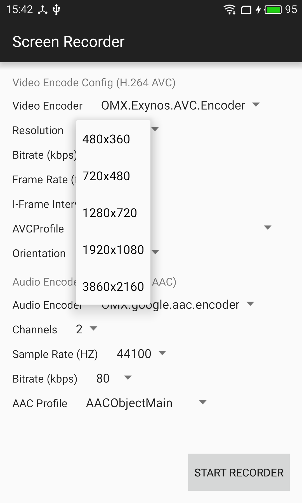

Screen Recorder

本项目的录屏功能来自 https://github.com/yrom/ScreenRecorder
=====
这是个DEMO APP 主要是实现了屏幕录制（可同时录制来自麦克风的声音）和实时坐标定位功能。



[][8]  [点此处下载APK][7] 快速预览项目功能

说明：使用了 [MediaProjectionManager][1], [VirtualDisplay][2], [AudioRecord][3], [MediaCodec][4] 以及 [MediaMuxer][5] 等API，故而这个项目最低支持Android 5.0。

录屏原理
=====
- `Display` 可以“投影”到一个 `VirtualDisplay`
- 通过 `MediaProjectionManager` 取得的 `MediaProjection`创建`VirtualDisplay` 
- `VirtualDisplay` 会将图像渲染到 `Surface`中，而这个`Surface`是由`MediaCodec`所创建的

```
mEncoder = MediaCodec.createEncoderByType(MIME_TYPE);
...
mSurface = mEncoder.createInputSurface();
...
mVirtualDisplay = mMediaProjection.createVirtualDisplay(name, mWidth, mHeight, mDpi, DisplayManager.VIRTUAL_DISPLAY_FLAG_PUBLIC, mSurface, null, null);
```

- `MediaMuxer` 将从 `MediaCodec` 得到的图像元数据封装并输出到MP4文件中

```
int index = mEncoder.dequeueOutputBuffer(mBufferInfo, TIMEOUT_US);
...
ByteBuffer encodedData = mEncoder.getOutputBuffer(index);
...
mMuxer.writeSampleData(mVideoTrackIndex, encodedData, mBufferInfo);
```
所以其实在**Android 4.4**上可以通过`DisplayManager`来创建`VirtualDisplay`也是可以实现录屏，但因为权限限制需要**ROOT**。 (see [DisplayManager.createVirtualDisplay()][6])

实时坐标定位功能
=====
app接收需要展示的坐标信息，在屏幕上实时绘制表示点击或者滑动的光标

接口
=====
### 启动录屏

```bash
$ http POST http://${ip}:9000 action=start_record
{
    "ret": 0,
    "data": data
}
```

### 结束录屏

```bash
$ http POST http://${ip}:9000 action=stop_record
{
    "ret": 0,
    "data": data
}
```

### 启动实时坐标定位

```bash
$ http POST http://${ip}:9000 action=start_coor
{
    "ret": 0,
    "data": data
}
```

### 关闭实时坐标定位

```bash
$ http POST http://${ip}:9000 action=stop_coor
{
    "ret": 0,
    "data": data
}
```

### 发送坐标数据

```bash
$ http POST http://${ip}:9000 action=coor data=${data} type=${type}
{
    "ret": 0,
    "data": data
}
```

[1]: https://developer.android.com/reference/android/media/projection/MediaProjectionManager.html
[2]: https://developer.android.com/reference/android/hardware/display/VirtualDisplay.html
[3]: https://developer.android.com/reference/android/media/AudioRecord.html
[4]: https://developer.android.com/reference/android/media/MediaCodec.html
[5]: https://developer.android.com/reference/android/media/MediaMuxer.html
[6]: https://developer.android.com/reference/android/hardware/display/DisplayManager.html
[7]: https://github.com/yrom/ScreenRecorder/releases/latest
[8]: https://play.google.com/store/apps/details?id=net.yrom.screenrecorder.demo
